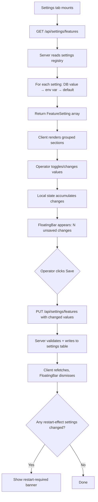

# Global Settings Panel — Design Document

## 1. Architecture Overview

The settings panel is a thin layer over the existing `settings` DB table. The server exposes a registry of feature settings (schema + current value); the client renders them generically. No new tables, no new auth, no new state management patterns.



---

## 2. Server-Side: Settings Registry

### 2.1 New File: `server/src/services/feature-settings.ts`

A declarative registry that defines every feature setting, its type, default, and how to resolve its current value.

```typescript
export interface FeatureSettingDef {
  key: string;
  label: string;
  description: string;
  type: 'boolean' | 'number';
  default: boolean | number;
  min?: number;
  max?: number;
  envVar?: string;         // optional env var to read from
  effect: 'live' | 'restart';
  group: string;
  /** For number settings paired with a boolean toggle: the toggle's key. */
  parentToggle?: string;
}

const REGISTRY: FeatureSettingDef[] = [
  // ── Resilience ──
  {
    key: 'provider_fastfail_enabled',
    label: 'Provider-Outage Fast-Fail',
    description: 'When ≥N distinct models on the same provider return 5xx within one request, skip all remaining models from that provider.',
    type: 'boolean',
    default: true,
    envVar: 'PROVIDER_FASTFAIL_ENABLED',
    effect: 'restart',
    group: 'Resilience',
  },
  {
    key: 'provider_fastfail_threshold',
    label: 'Fast-Fail Threshold',
    description: 'Number of distinct models on one provider that must 5xx before the provider is skipped. Set to 0 to disable.',
    type: 'number',
    default: 2,
    min: 0,
    max: 10,
    envVar: 'PROVIDER_FASTFAIL_THRESHOLD',
    effect: 'restart',
    group: 'Resilience',
    parentToggle: 'provider_fastfail_enabled',
  },
  {
    key: 'heartbeat_enabled',
    label: 'Provider Health Heartbeat',
    description: 'Send periodic health-check pings to each provider. Feeds the degradation engine so the router avoids sick providers proactively.',
    type: 'boolean',
    default: false,
    envVar: 'HEARTBEAT_ENABLED',
    effect: 'restart',
    group: 'Resilience',
  },
  {
    key: 'heartbeat_interval_min',
    label: 'Heartbeat Interval',
    description: 'Minutes between health-check ping cycles.',
    type: 'number',
    default: 10,
    min: 1,
    max: 60,
    envVar: 'HEARTBEAT_INTERVAL_MIN',
    effect: 'restart',
    group: 'Resilience',
    parentToggle: 'heartbeat_enabled',
  },
  {
    key: 'heartbeat_activity_window_min',
    label: 'Activity Window',
    description: 'Maximum minutes since the last user request for heartbeat pings to fire. Prevents pinging when nobody is using the system.',
    type: 'number',
    default: 15,
    min: 5,
    max: 60,
    envVar: 'HEARTBEAT_ACTIVITY_WINDOW_MIN',
    effect: 'restart',
    group: 'Resilience',
    parentToggle: 'heartbeat_enabled',
  },
  // ── Sessions ──
  {
    key: 'sticky_session_enabled',
    label: 'Sticky Sessions',
    description: 'Route all requests in a conversation to the same model to prevent mid-conversation model switches and hallucination.',
    type: 'boolean',
    default: false,
    envVar: 'STICKY_SESSION_ENABLED',
    effect: 'live',
    group: 'Sessions',
  },
];
```

### 2.2 Resolution Logic

```typescript
export function resolveSetting(def: FeatureSettingDef): boolean | number {
  // Priority: DB → env var → default
  const dbValue = getSetting(def.key);
  if (dbValue !== null) {
    return def.type === 'boolean'
      ? dbValue === 'true'
      : parseFloat(dbValue);
  }

  if (def.envVar && process.env[def.envVar] !== undefined) {
    const raw = process.env[def.envVar]!;
    return def.type === 'boolean'
      ? raw === 'true'
      : parseFloat(raw);
  }

  return def.default;
}
```

### 2.3 Live vs Running Values

For `restart`-effect settings, the server tracks two values:
- **running**: the value the server started with (read from env/DB at module load)
- **saved**: the current DB value (may differ from running if changed via dashboard)

The `GET` response includes `pendingRestart: true` when any saved value differs from the running value for restart-effect settings.

```typescript
// Module-level snapshot taken at startup
const runningValues = new Map<string, boolean | number>();

export function captureRunningValues(): void {
  for (const def of REGISTRY) {
    runningValues.set(def.key, resolveSetting(def));
  }
}

export function hasPendingRestart(): boolean {
  for (const def of REGISTRY) {
    if (def.effect === 'restart') {
      const running = runningValues.get(def.key);
      const saved = resolveSetting(def);
      if (running !== saved) return true;
    }
  }
  return false;
}
```

### 2.4 Exported API

```typescript
/** Resolve current value for a setting key (DB → env → default). */
export function getFeatureSetting(key: string): boolean | number;

/** Get all settings with full metadata for the API response. */
export function getAllFeatureSettings(): Array<FeatureSetting & { value: boolean | number }>;

/** Validate and save a partial update of settings. Returns the updated settings. */
export function saveFeatureSettings(updates: Record<string, boolean | number>): void;

/** Capture running values at startup (called from index.ts). */
export function captureRunningValues(): void;

/** Check if any restart-effect setting differs from running value. */
export function hasPendingRestart(): boolean;
```

---

## 3. Server-Side: API Routes

### 3.1 Extend `server/src/routes/settings.ts`

The existing `settings.ts` route file handles unified API key management. Add two new routes:

```typescript
// GET /api/settings/features
settingsRouter.get('/features', (req, res) => {
  const settings = getAllFeatureSettings();
  res.json({
    settings,
    pendingRestart: hasPendingRestart(),
  });
});

// PUT /api/settings/features
settingsRouter.put('/features', (req, res) => {
  const updates = req.body as Record<string, boolean | number>;

  // Validate
  const errors: string[] = [];
  for (const [key, value] of Object.entries(updates)) {
    const def = REGISTRY.find(d => d.key === key);
    if (!def) { errors.push(`Unknown setting: ${key}`); continue; }
    if (def.type === 'boolean' && typeof value !== 'boolean') {
      errors.push(`${key}: expected boolean, got ${typeof value}`);
    }
    if (def.type === 'number') {
      if (typeof value !== 'number' || isNaN(value)) {
        errors.push(`${key}: expected number`);
      } else if (def.min !== undefined && value < def.min) {
        errors.push(`${key}: must be ≥ ${def.min}`);
      } else if (def.max !== undefined && value > def.max) {
        errors.push(`${key}: must be ≤ ${def.max}`);
      }
    }
  }
  if (errors.length > 0) {
    res.status(400).json({ error: errors.join('; ') });
    return;
  }

  saveFeatureSettings(updates);
  res.json({ settings: getAllFeatureSettings(), pendingRestart: hasPendingRestart() });
});
```

---

## 4. Client-Side: Settings Page

### 4.1 New File: `client/src/pages/SettingsPage.tsx`

The main page component. Fetches settings, renders grouped sections, manages local state.

```typescript
export function SettingsPage() {
  const { data, refetch } = useQuery({ queryKey: ['settings', 'features'], queryFn: fetchFeatureSettings });
  const saveMutation = useMutation({ mutationFn: saveFeatureSettings, onSuccess: () => refetch() });

  const [localValues, setLocalValues] = useState<Record<string, boolean | number>>({});
  const changedKeys = Object.keys(localValues).filter(k => localValues[k] !== data?.settings.find(s => s.key === k)?.value);
  const hasChanges = changedKeys.length > 0;

  // Group settings by `group` field
  const groups = useMemo(() => groupBy(data?.settings ?? [], s => s.group), [data]);

  return (
    <>
      {data?.pendingRestart && <RestartBanner />}
      {Object.entries(groups).map(([group, settings]) => (
        <SettingsSection key={group} title={group} settings={settings}
          localValues={localValues} onChange={setLocalValues} />
      ))}
      {hasChanges && (
        <FloatingBar
          count={changedKeys.length}
          onDiscard={() => setLocalValues({})}
          onSave={() => saveMutation.mutate(changedEntries)}
        />
      )}
    </>
  );
}
```

### 4.2 New File: `client/src/components/settings-section.tsx`

Renders a group of settings as a card with section header.

```typescript
function SettingsSection({ title, settings, localValues, onChange }) {
  return (
    <Card>
      <CardHeader><CardTitle>{title}</CardTitle></CardHeader>
      <CardContent className="space-y-6">
        {settings.map(setting => (
          <SettingRow key={setting.key} setting={setting}
            value={localValues[setting.key] ?? setting.value}
            onChange={(v) => onChange(prev => ({ ...prev, [setting.key]: v }))}
            disabled={setting.parentToggle && !(localValues[setting.parentToggle] ?? settings.find(s => s.key === setting.parentToggle)?.value)}
          />
        ))}
      </CardContent>
    </Card>
  );
}
```

### 4.3 New File: `client/src/components/setting-row.tsx`

Renders a single setting — handles both boolean (Switch) and number (Input) types.

```typescript
function SettingRow({ setting, value, onChange, disabled }) {
  return (
    <div className="flex items-center justify-between gap-4">
      <div className="flex-1">
        <div className="flex items-center gap-2">
          <Label>{setting.label}</Label>
          {setting.effect === 'restart' && (
            <Badge variant="outline" className="text-xs">↻ restart</Badge>
          )}
        </div>
        <p className="text-sm text-muted-foreground">{setting.description}</p>
      </div>
      {setting.type === 'boolean' ? (
        <Switch checked={value} onCheckedChange={onChange} disabled={disabled} />
      ) : (
        <Input type="number" value={value} min={setting.min} max={setting.max}
          onChange={(e) => onChange(parseFloat(e.target.value))}
          className="w-24" disabled={disabled} />
      )}
    </div>
  );
}
```

### 4.4 Navigation Update in `App.tsx`

Add a Settings tab to the existing nav:

```typescript
import { Settings } from 'lucide-react';
// ... in the nav items array:
{ label: 'Settings', path: '/settings', icon: Settings }
```

Add the route:

```typescript
<Route path="/settings" element={<SettingsPage />} />
```

---

## 5. Integration Points

### 5.1 How the fast-fail reads its settings

Currently the fast-fail spec reads `process.env.PROVIDER_FASTFAIL_THRESHOLD` at module load. With the settings panel, it should also check the DB:

```typescript
// In proxy.ts (module-level)
const rawThreshold = getFeatureSetting('provider_fastfail_threshold') as number;
const fastfailEnabled = getFeatureSetting('provider_fastfail_enabled') as boolean;
const PROVIDER_FASTFAIL_THRESHOLD = fastfailEnabled ? rawThreshold : 0;
```

This replaces the direct `parseInt(process.env.PROVIDER_FASTFAIL_THRESHOLD ?? '2', 10)`.

### 5.2 How the heartbeat reads its settings

Similarly:

```typescript
// In heartbeat.ts (module-level)
const ENABLED = getFeatureSetting('heartbeat_enabled') as boolean;
const INTERVAL_MS = (getFeatureSetting('heartbeat_interval_min') as number) * 60 * 1000;
const ACTIVITY_WINDOW_MS = (getFeatureSetting('heartbeat_activity_window_min') as number) * 60 * 1000;
```

### 5.3 How sticky sessions reads its setting

Currently: `process.env.STICKY_SESSION_ENABLED === 'true'` at every request call.

With settings panel: read from `getFeatureSetting('sticky_session_enabled')`. Since this is a `live`-effect setting, it should be resolved per-call (not cached at module level):

```typescript
// In proxy.ts, isStickySessionEnabled():
function isStickySessionEnabled(): boolean {
  return getFeatureSetting('sticky_session_enabled') as boolean;
}
```

### 5.4 Files Changed

| File | Change |
|---|---|
| `server/src/services/feature-settings.ts` | **New** — settings registry, resolution, validation |
| `server/src/routes/settings.ts` | **Extend** — add GET/PUT `/features` endpoints |
| `server/src/index.ts` | **Extend** — call `captureRunningValues()` at startup |
| `client/src/pages/SettingsPage.tsx` | **New** — settings page component |
| `client/src/components/settings-section.tsx` | **New** — grouped section renderer |
| `client/src/components/setting-row.tsx` | **New** — individual setting row (Switch or Input) |
| `client/src/App.tsx` | **Extend** — add Settings tab + route |
| `client/src/lib/api.ts` | **Extend** — add `fetchFeatureSettings` and `saveFeatureSettings` functions |
| `server/src/routes/proxy.ts` | **Extend** — read fast-fail + sticky settings from registry |
| `server/src/services/heartbeat.ts` | **Extend** — read heartbeat settings from registry |

### 5.5 Files NOT Changed

- `router.ts` — no changes
- `scoring.ts` — no changes
- `ratelimit.ts` — no changes
- `degradation.ts` — no changes
- `key-exhaustion.ts` — no changes
- `live-events.tsx` — no changes
- `FloatingBar` component — reused as-is

---

## 6. Edge Cases

### 6.1 First Launch (No DB Values)

No settings in DB. `resolveSetting` falls back to env vars, then defaults. The dashboard shows factory defaults. **Correct**: identical to today's behavior.

### 6.2 Env Var Override After Dashboard Save

Operator sets `HEARTBEAT_ENABLED=true` in `.env`, then later disables via dashboard (DB writes `false`). DB value wins (priority: DB > env > default). **Correct**: the dashboard is the authoritative source once used.

### 6.3 Invalid Numeric Input

Operator types `-5` into the threshold field. Client-side validation: `min=0` on the Input prevents submission. Server-side validation: returns 400 if value < min. **Correct**: defense in depth.

### 6.4 Toggle Off Disables Children

Operator toggles heartbeat OFF. The interval and activity window inputs grey out. Their values are preserved in state but visually disabled. When the operator re-enables the toggle, the previous values are still there. **Correct**: no data loss on toggle.

### 6.5 Restart-Required Banner After Save

Operator changes heartbeat interval from 10 to 5 (restart-effect). Saves. The banner appears: "Some changes require a server restart." The running value is still 10; the saved (DB) value is 5. After restart, `captureRunningValues()` reads 5, banner disappears. **Correct**.

### 6.6 Sticky Session (Live Effect)

Operator toggles sticky sessions ON. No restart banner — the change is live. The next request checks `getFeatureSetting('sticky_session_enabled')` which reads from DB → returns `true`. **Correct**: live-effect settings resolve per-request.

---

## 7. Testing Strategy

### 7.1 Server Unit Tests (`feature-settings.test.ts`)

| Test Case | Assertion |
|---|---|
| Default values when no DB or env | Returns factory defaults for all settings |
| Env var overrides default | Set env var → resolveSetting returns env value |
| DB overrides env var | Write DB value → resolveSetting returns DB value |
| Validation rejects invalid type | PUT `{ heartbeat_interval_min: "abc" }` → 400 |
| Validation rejects out-of-range | PUT `{ provider_fastfail_threshold: 99 }` → 400 |
| Partial update works | PUT `{ heartbeat_enabled: true }` → only that key written |
| pendingRestart detects divergence | Change restart-effect setting → `hasPendingRestart()` returns true |
| Unknown setting key rejected | PUT `{ fake_setting: true }` → 400 |

### 7.2 Client Considerations

- Test that `SettingsPage` renders all groups from the API response
- Test that `FloatingBar` appears when local values differ from server values
- Test that `parentToggle` disables child inputs when parent is OFF
- Test that restart badge renders for `effect: 'restart'` settings
