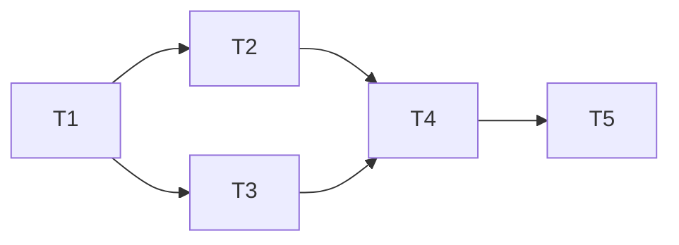

# Global Settings Panel — Implementation Tasks

### Dependency Graph



Tasks 2 and 3 can run in parallel after Task 1. Task 4 depends on both. Task 5 depends on Task 4.

---

## Task 1: Server — Create feature-settings registry

### What to build

New file `server/src/services/feature-settings.ts` containing the settings registry, resolution logic, validation, and running-value tracking.

### Module contents

**Registry array** — declarative definitions of all feature settings (see design doc §2.1 for full list).

**`resolveSetting(def)`** — resolves current value: DB → env var → default. Uses existing `getSetting(key)` from `db/index.ts`.

**`getFeatureSetting(key)`** — public API to resolve a single setting by key. Looks up the definition in the registry, calls `resolveSetting`.

**`getAllFeatureSettings()`** — returns the full registry with resolved values for the API response. Shape: `Array<FeatureSettingDef & { value: boolean | number }>`.

**`saveFeatureSettings(updates)`** — validates and writes each key to the `settings` table via existing `setSetting(key, value)`. Validates type, min/max before writing.

**`captureRunningValues()`** — snapshots all resolved values at startup into a module-level Map. Called once from `index.ts`.

**`hasPendingRestart()`** — compares running values against current resolved values for restart-effect settings. Returns `true` if any differ.

### Imports needed

```typescript
import { getSetting, setSetting } from '../db/index.js';
```

### Critical invariants

- The registry is a frozen array — no runtime modifications
- `getFeatureSetting` throws if the key doesn't exist in the registry (catches typos at startup)
- `saveFeatureSettings` writes to the DB table that already exists (`settings` with columns `key TEXT PRIMARY KEY, value TEXT`)
- `captureRunningValues` must be called AFTER `initDegradation()` and DB init in the startup sequence
- Env var parsing must handle `'true'`/`'false'` strings for booleans (not truthy/falsy)

---

## Task 2: Server — Add API routes to `settings.ts`

### What to build

Extend the existing `server/src/routes/settings.ts` with two new endpoints.

### Exact changes

**2a.** Add `GET /features` route:

```typescript
settingsRouter.get('/features', (req: Request, res: Response) => {
  const settings = getAllFeatureSettings();
  res.json({ settings, pendingRestart: hasPendingRestart() });
});
```

**2b.** Add `PUT /features` route with validation:

```typescript
settingsRouter.put('/features', (req: Request, res: Response) => {
  const updates = req.body as Record<string, boolean | number>;
  // Validate each key against the registry (type check, min/max)
  // Return 400 with error messages if invalid
  // Otherwise call saveFeatureSettings(updates)
  // Return updated settings + pendingRestart
});
```

### Imports needed

```typescript
import { getAllFeatureSettings, saveFeatureSettings, hasPendingRestart, REGISTRY } from '../services/feature-settings.js';
```

### Critical invariants

- Both routes are on the existing `settingsRouter` — same auth middleware as the API key endpoints
- Validation happens server-side (defense in depth — client validates too, but server is authoritative)
- Partial updates: only the keys present in the request body are written
- The response always includes the full settings array + pendingRestart flag (so the client can refresh its state)

---

## Task 3: Client — Create settings page and components

### What to build

Three new client files for the settings UI.

### Exact changes

**3a.** `client/src/pages/SettingsPage.tsx` — Main page:
- `useQuery` fetches `GET /api/settings/features`
- `useMutation` calls `PUT /api/settings/features`
- Local state for unsaved changes
- Groups settings by `group` field, renders `SettingsSection` for each
- Shows `FloatingBar` when changes exist
- Shows `RestartBanner` when `pendingRestart` is true

**3b.** `client/src/components/settings-section.tsx` — Grouped section:
- Renders a `Card` with section title
- Iterates settings within the group
- Passes `disabled` to child settings when their `parentToggle` is OFF

**3c.** `client/src/components/setting-row.tsx` — Individual setting:
- Renders `Switch` for boolean, `Input[type=number]` for number
- Shows label, description, restart badge
- Handles `disabled` state (greyed out when parent toggle is off)

### UI components used (all existing)

| Component | Source |
|---|---|
| `Card`, `CardHeader`, `CardTitle`, `CardContent` | `@/components/ui/card` |
| `Switch` | `@/components/ui/switch` |
| `Input` | `@/components/ui/input` |
| `Label` | `@/components/ui/label` |
| `Badge` | `@/components/ui/badge` |
| `FloatingBar` | `@/components/floating-bar` |
| `Settings` (icon) | `lucide-react` |

### API functions to add to `client/src/lib/api.ts`

```typescript
export async function fetchFeatureSettings() {
  const res = await apiFetch('/settings/features');
  return res.json();
}

export async function saveFeatureSettings(updates: Record<string, boolean | number>) {
  const res = await apiFetch('/settings/features', {
    method: 'PUT',
    headers: { 'Content-Type': 'application/json' },
    body: JSON.stringify(updates),
  });
  return res.json();
}
```

### Critical invariants

- `FloatingBar` pattern matches existing usage in `FallbackPage` and `KeysPage`
- Settings render generically from the API response — no hardcoded feature knowledge in the client
- `parentToggle` logic: look up the parent's current (local or server) value to determine disabled state
- Number inputs clamp to min/max on blur, not on every keystroke (less annoying UX)

---

## Task 4: Client — Wire settings into navigation

### What to build

Add the Settings tab to the dashboard navigation and routing.

### Exact changes

**4a.** In `client/src/App.tsx`, add to the nav items:

```typescript
import { Settings } from 'lucide-react';
// In navItems array:
{ label: 'Settings', path: '/settings', icon: Settings }
```

**4b.** Add the route:

```typescript
import { SettingsPage } from './pages/SettingsPage';
// In route config:
<Route path="/settings" element={<SettingsPage />} />
```

### Critical invariants

- The Settings tab appears LAST in the nav (after Analytics)
- Uses the `Settings` icon from lucide-react (gear icon)
- Lazy-loaded if the app uses `React.lazy` for other pages (match existing pattern)

---

## Task 5: Server — Wire feature settings into existing code

### What to build

Update `proxy.ts` and `heartbeat.ts` to read their settings from the feature-settings registry instead of directly from env vars.

### Exact changes

**5a.** In `server/src/routes/proxy.ts` — fast-fail threshold:

Replace the module-level env var read:
```typescript
// OLD:
const PROVIDER_FASTFAIL_THRESHOLD = parseInt(process.env.PROVIDER_FASTFAIL_THRESHOLD ?? '2', 10);
// NEW:
import { getFeatureSetting } from '../services/feature-settings.js';
const PROVIDER_FASTFAIL_THRESHOLD = getFeatureSetting('provider_fastfail_enabled')
  ? (getFeatureSetting('provider_fastfail_threshold') as number)
  : 0;
```

**5b.** In `server/src/routes/proxy.ts` — sticky sessions:

Replace the env var check:
```typescript
// OLD:
function isStickySessionEnabled(): boolean {
  return process.env.STICKY_SESSION_ENABLED === 'true';
}
// NEW:
function isStickySessionEnabled(): boolean {
  return getFeatureSetting('sticky_session_enabled') as boolean;
}
```

**5c.** In `server/src/services/heartbeat.ts` — heartbeat config:

Replace env var reads:
```typescript
// OLD:
const ENABLED = process.env.HEARTBEAT_ENABLED === 'true';
const INTERVAL_MS = (parseInt(process.env.HEARTBEAT_INTERVAL_MIN ?? '10', 10)) * 60 * 1000;
// NEW:
import { getFeatureSetting } from './feature-settings.js';
const ENABLED = getFeatureSetting('heartbeat_enabled') as boolean;
const INTERVAL_MS = (getFeatureSetting('heartbeat_interval_min') as number) * 60 * 1000;
```

**5d.** In `server/src/index.ts` — capture running values:

```typescript
import { captureRunningValues } from './services/feature-settings.js';
// After DB init and before server.listen():
captureRunningValues();
```

### Critical invariants

- `getFeatureSetting` for `restart`-effect settings is called at **module load** — the value is frozen until restart. This matches the `restart` semantics.
- `getFeatureSetting` for `live`-effect settings is called **per-request** (inside a function, not at module level). This matches the `live` semantics — changes take effect immediately.
- `captureRunningValues()` must be called after DB init but before the server starts accepting requests
- The `settings` table already exists in the schema — no migration needed

---

## Task 6: Tests — Add unit tests for feature-settings

### What to build

New test file `server/src/__tests__/services/feature-settings.test.ts`.

### Test cases

| Test | Setup | Assertion |
|---|---|---|
| Returns defaults when no DB/env | Clean DB, no env vars | All settings return factory defaults |
| Env var overrides default | Set `HEARTBEAT_ENABLED=true` | `heartbeat_enabled` resolves to `true` |
| DB overrides env var | Write DB `heartbeat_enabled=false`, env=`true` | Resolves to `false` |
| Boolean env parsing | `STICKY_SESSION_ENABLED=true` | Resolves to `true` (not `"true"`) |
| Number env parsing | `HEARTBEAT_INTERVAL_MIN=5` | Resolves to `5` (number, not string) |
| Validates type on save | Save `{ heartbeat_interval_min: "abc" }` | Throws/returns error |
| Validates min on save | Save `{ provider_fastfail_threshold: -1 }` | Throws/returns error |
| Validates max on save | Save `{ heartbeat_interval_min: 999 }` | Throws/returns error |
| Rejects unknown key | Save `{ fake_setting: true }` | Throws/returns error |
| Partial update | Save `{ heartbeat_enabled: true }` | Only that key written; others unchanged |
| pendingRestart detects divergence | Change restart setting, don't restart | `hasPendingRestart()` = `true` |
| pendingRestart false when matching | No changes after capture | `hasPendingRestart()` = `false` |
| getAllFeatureSettings shape | Call function | Returns array with `key`, `label`, `value`, `type`, `effect`, `group` |

---

## Task 7: Run existing test suite to verify no regressions

### What to do

After Tasks 1-6 are complete, run:

```bash
npm run test -w server
npm run test -w client
```

Verify:
- All existing tests pass
- New feature-settings tests pass
- Client typecheck passes (SettingsPage imports, App.tsx routing)

### Expected failures

None — the feature-settings module is purely additive. The only changes to existing files are:
- `proxy.ts`: two lines changed (env var reads → registry reads)
- `heartbeat.ts`: three lines changed (same pattern)
- `settings.ts`: two new routes added
- `App.tsx`: one nav item + one route added

If any existing test breaks, it indicates the registry resolution is returning a different value than the env var it replaced.
