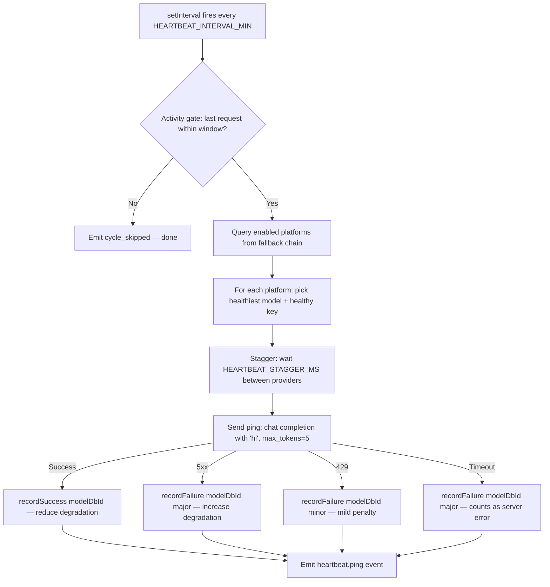

# Provider Health Heartbeat — Design Document

## 1. Architecture Overview

The heartbeat is a standalone background service that runs on a timer. It sends minimal pings to providers and feeds results into the existing degradation engine. No changes to the routing pipeline — the bandit scorer naturally avoids degraded providers.



**The rest of the pipeline doesn't change.** `routeRequest()`, `orderChain()`, degradation, key selection — they all work as before. The heartbeat simply feeds `recordSuccess`/`recordFailure` proactively instead of waiting for real requests.

---

## 2. Module Structure

### 2.1 New File: `server/src/services/heartbeat.ts`

A single new module encapsulates all heartbeat logic:

```typescript
// Module-level state
let timerRef: NodeJS.Timeout | null = null;
let lastActivityAt = 0;  // Updated by proxy.ts on every request

// Configuration (read once at startup)
const ENABLED = process.env.HEARTBEAT_ENABLED === 'true';
const INTERVAL_MS = (parseInt(process.env.HEARTBEAT_INTERVAL_MIN ?? '10', 10)) * 60 * 1000;
const ACTIVITY_WINDOW_MS = (parseInt(process.env.HEARTBEAT_ACTIVITY_WINDOW_MIN ?? '15', 10)) * 60 * 1000;
const PING_TIMEOUT_MS = parseInt(process.env.HEARTBEAT_TIMEOUT_MS ?? '10000', 10);
const STAGGER_MS = parseInt(process.env.HEARTBEAT_STAGGER_MS ?? '2000', 10);
```

### 2.2 Exported API

```typescript
/** Called from proxy.ts on every /chat/completions request (success or failure). */
export function recordActivity(): void;

/** Called from server startup (index.ts) to begin the timer. */
export function startHeartbeat(): void;

/** Called from graceful shutdown handler. */
export function stopHeartbeat(): void;
```

That's it — three functions. The timer, ping logic, and provider selection are internal.

---

## 3. Core Algorithm

### 3.1 Cycle Logic

```typescript
async function runCycle(): Promise<void> {
  const now = Date.now();

  // ── Activity gate ──
  if (lastActivityAt === 0 || now - lastActivityAt > ACTIVITY_WINDOW_MS) {
    publish({
      type: 'heartbeat.cycle_skipped',
      reason: 'activity_gate',
      lastActivityAgeMs: lastActivityAt === 0 ? -1 : now - lastActivityAt,
      at: now,
    } as any);
    return;
  }

  // ── Get platforms ──
  const db = getDb();
  const platforms = db.prepare(`
    SELECT DISTINCT m.platform, m.id AS model_db_id, m.model_id
    FROM fallback_config fc
    JOIN models m ON m.id = fc.model_db_id AND m.enabled = 1
    WHERE fc.enabled = 1
  `).all() as Array<{ platform: string; model_db_id: number; model_id: string }>;

  // Group by platform, pick the healthiest model per platform
  const byPlatform = new Map<string, { modelDbId: number; modelId: string; penalty: number }>();
  for (const row of platforms) {
    const existing = byPlatform.get(row.platform);
    const penalty = getPenalty(row.model_db_id);
    if (!existing || penalty < existing.penalty) {
      byPlatform.set(row.platform, {
        modelDbId: row.model_db_id,
        modelId: row.model_id,
        penalty,
      });
    }
  }

  // ── Ping each provider (staggered) ──
  for (const [platform, model] of byPlatform) {
    await pingProvider(platform, model.modelDbId, model.modelId);
    if (STAGGER_MS > 0) {
      await new Promise(resolve => setTimeout(resolve, STAGGER_MS));
    }
  }
}
```

### 3.2 Ping Logic

```typescript
async function pingProvider(platform: string, modelDbId: number, modelId: string): Promise<void> {
  const db = getDb();

  // Find a healthy, non-cooldown, non-exhausted key
  const keys = db.prepare(
    "SELECT * FROM api_keys WHERE platform = ? AND enabled = 1 AND status IN ('healthy', 'unknown')"
  ).all(platform) as KeyRow[];

  let targetKey: KeyRow | null = null;
  for (const key of keys) {
    if (!isOnCooldown(platform, modelId, key.id) && !isExhausted(key.id)) {
      targetKey = key;
      break;
    }
  }

  if (!targetKey) {
    // No eligible key — skip this provider silently
    return;
  }

  const start = Date.now();
  const provider = buildProviderFor(platform);
  if (!provider) return;

  let decryptedKey: string;
  try {
    decryptedKey = decrypt(targetKey.encrypted_key, targetKey.iv, targetKey.auth_tag);
  } catch {
    return; // Key decryption failed — skip, don't penalize
  }

  try {
    const result = await withTimeout(
      provider.chatCompletion(
        decryptedKey,
        [{ role: 'user', content: 'hi' }],
        modelId,
        { max_tokens: 5, temperature: 0 },
      ),
      PING_TIMEOUT_MS,
    );

    // Success — record and emit
    recordSuccess(modelDbId);
    publish({
      type: 'heartbeat.ping',
      provider: platform,
      model: modelId,
      success: true,
      latencyMs: Date.now() - start,
      at: Date.now(),
    } as any);

  } catch (err: any) {
    const tier = classifyError(err);
    const latencyMs = Date.now() - start;

    // Only record degradation for retryable errors (5xx, 429)
    // Non-retryable (401, 403, 404) are config issues, not health signals
    if (tier === 'major') {
      recordFailure(modelDbId, 'major');
    } else if (tier === 'minor') {
      recordFailure(modelDbId, 'minor');
    }
    // tier === null → non-retryable config error, log but don't penalize

    publish({
      type: 'heartbeat.ping',
      provider: platform,
      model: modelId,
      success: false,
      latencyMs,
      error: err?.message?.slice(0, 120) ?? 'unknown',
      at: Date.now(),
    } as any);
  }
}
```

### 3.3 Timeout Helper

```typescript
function withTimeout<T>(promise: Promise<T>, ms: number): Promise<T> {
  return new Promise((resolve, reject) => {
    const timer = setTimeout(() => reject(new Error(`heartbeat ping timed out after ${ms}ms`)), ms);
    promise
      .then(v => { clearTimeout(timer); resolve(v); })
      .catch(e => { clearTimeout(timer); reject(e); });
  });
}
```

A timed-out ping is classified as `'major'` by `classifyError` (matches `'timeout'` in message) — correct behavior: a provider that doesn't respond in 10s is unhealthy.

---

## 4. Integration Points

### 4.1 Changes to `proxy.ts`

Add a single call at the top of the `/chat/completions` handler (after authentication, ~L492):

```typescript
import { recordActivity } from '../services/heartbeat.js';
// ...
recordActivity();  // Update heartbeat activity gate
```

This is one line. It updates a module-level timestamp — O(1), no I/O.

### 4.2 Changes to `server/src/services/events.ts`

Add two event variants to the `LiveEvent` union:

```typescript
| { type: 'heartbeat.ping'; provider: string; model: string; success: boolean; latencyMs: number; error?: string; at: number }
| { type: 'heartbeat.cycle_skipped'; reason: string; lastActivityAgeMs: number; at: number }
```

### 4.3 Changes to `server/src/index.ts` (or server bootstrap)

```typescript
import { startHeartbeat, stopHeartbeat } from './services/heartbeat.js';

// After server starts listening:
startHeartbeat();

// In graceful shutdown handler:
stopHeartbeat();
```

### 4.4 Changes to `client/src/components/live-events.tsx`

Add interfaces, union members, and rendering cases:

```typescript
interface HeartbeatPingEvent extends LiveEventBase {
  type: 'heartbeat.ping';
  provider: string;
  model: string;
  success: boolean;
  latencyMs: number;
  error?: string;
}

// In formatEvent switch:
case 'heartbeat.ping':
  if (evt.success) {
    return { id: evt.id, ts, kind: 'info',
      text: `♥ [heartbeat] ${evt.provider}/${evt.model} healthy (${evt.latencyMs}ms)` };
  }
  return { id: evt.id, ts, kind: 'warn',
    text: `♥ [heartbeat] ${evt.provider}/${evt.model} FAILED: ${evt.error?.slice(0, 60) ?? 'unknown'}` };
```

### 4.5 Files NOT Changed

- `router.ts` — no changes; degradation scoring handles everything
- `scoring.ts` — no changes
- `ratelimit.ts` — no changes; pings don't count toward limits
- `key-exhaustion.ts` — no changes; pings don't mark keys exhausted
- `degradation.ts` — no changes; `recordSuccess`/`recordFailure`/`classifyError` reused as-is

---

## 5. Worked Example — Preventing the Observed Incident

**Setup**: Provider "bluesminds" with 2 models (kimi-k2.6, glm-5.1). Provider "cloudflare" with 1 model (kimi-k2.6). Heartbeat enabled, 10-min interval. Bluesminds goes down at T=0.

| Time | Event | Degradation State |
|---|---|---|
| T=-10min | Last user request served normally | All penalties = 0 |
| T=0 | Bluesminds goes down (upstream outage) | — |
| T=10min | Heartbeat fires. Activity gate passes (last request 20min ago... borderline). Pings bluesminds/kimi-k2.6 → 503. Pings cloudflare/kimi-k2.6 → 200. | bluesminds/kimi penalty += 3.0 (major). cloudflare/kimi penalty -= recovery |
| T=20min | Heartbeat fires. Activity gate: last request 30min ago → **skip** (beyond 15min window). | No change |
| T=25min | User request arrives. Bandit scorer sees: bluesminds/kimi penalty=3.0, cloudflare/kimi penalty=0. Routes to **cloudflare first**. | Request succeeds on first attempt |

**Without heartbeat**: First request hits bluesminds, burns 2-30 attempts discovering the outage, then fails over.

**With heartbeat**: First request routes to healthy cloudflare immediately. Fast-fail never needed.

---

## 6. Edge Cases

### 6.1 All Providers Down

Every ping in a cycle fails with 5xx. All models get degradation penalties. When a user request arrives, the bandit scorer picks the least-degraded model — same behavior as today, but the degradation is *already accumulated* so the first request doesn't need to discover the outage.

### 6.2 Provider Recovers Between Cycles

Ping at T=10 fails (5xx, penalty++). Provider recovers at T=15. Ping at T=20 succeeds (recordSuccess reduces penalty). Model becomes competitive again in the bandit scorer. **Correct**: natural recovery via the existing success-recovery path in `degradation.ts`.

### 6.3 Single-Model Provider

Provider has 1 model. Heartbeat pings it. If it fails, penalty accumulates. If the user's fallback chain has other providers, the bandit routes away. If this is the only provider, the penalty doesn't matter (nowhere else to go). **Correct**: no special handling needed.

### 6.4 Activity Gate Boundary

Last request was 14 minutes 59 seconds ago. Activity window is 15 minutes. Gate passes → pings fire. Last request was 15 minutes 1 second ago → gate blocks → pings skip. The boundary is a simple timestamp comparison — no hysteresis. **Acceptable**: a missed cycle is harmless; the next cycle fires in 10 minutes.

### 6.5 Provider with No Eligible Keys

All keys for a provider are on cooldown or exhausted. The ping loop finds no eligible key → skips that provider silently. **Correct**: no point pinging if no key can serve a real request either.

### 6.6 Heartbeat Disabled (Default)

`HEARTBEAT_ENABLED` is `false` by default. `startHeartbeat()` is a no-op when disabled. No timer created, no pings sent, zero behavior change. **Correct**: opt-in feature.

### 6.7 Concurrent Cycles

If a cycle takes longer than `HEARTBEAT_INTERVAL_MIN` (e.g., 5 providers × 2s stagger = 10s of pinging, plus 10s timeouts = up to 60s), the next `setInterval` fires while the previous cycle is still running. Guard: a `cycleInProgress` flag prevents overlap.

### 6.8 Pinned Model Requests

User pins a model on a degraded provider. The heartbeat's degradation penalty doesn't affect pinned routing — `routeRequest` tries the preferred model first regardless of score. **Correct**: pin mode is an explicit user choice; the heartbeat shouldn't override it.

---

## 7. Testing Strategy

### 7.1 Unit Tests (`heartbeat.test.ts`)

| Test Case | Setup | Assertion |
|---|---|---|
| Activity gate blocks when idle | `lastActivityAt = 0` or old timestamp | `runCycle()` emits `cycle_skipped`, no pings sent |
| Activity gate passes when recent | `lastActivityAt = Date.now() - 5min` | Pings fire for all enabled platforms |
| Ping success calls recordSuccess | Mock provider returns 200 | `recordSuccess` called with correct modelDbId |
| Ping 503 calls recordFailure(major) | Mock provider throws 503 | `recordFailure` called with `'major'` |
| Ping 429 calls recordFailure(minor) | Mock provider throws 429 | `recordFailure` called with `'minor'` |
| Ping timeout classified as major | Mock provider hangs beyond PING_TIMEOUT_MS | `recordFailure` called with `'major'` |
| No eligible key skips provider | All keys on cooldown | Provider skipped, no error, no event |
| Event emitted per ping | Normal cycle | One `heartbeat.ping` event per provider |
| Disabled feature is no-op | `HEARTBEAT_ENABLED=false` | `startHeartbeat()` creates no timer |
| Stagger delays between providers | 3 providers, STAGGER_MS=100 | Total cycle time >= 200ms |
| Non-retryable error not penalized | Mock throws 401 | `recordFailure` NOT called |

### 7.2 Integration Considerations

- Tests mock `buildProviderFor` to return a mock provider with controllable `chatCompletion`
- Tests mock `decrypt` to return a fixed key string
- Tests use a real in-memory SQLite database for fallback chain queries
- `recordActivity()` tested independently — just updates a timestamp
- `startHeartbeat`/`stopHeartbeat` tested with fake timers (`vi.useFakeTimers()`)
