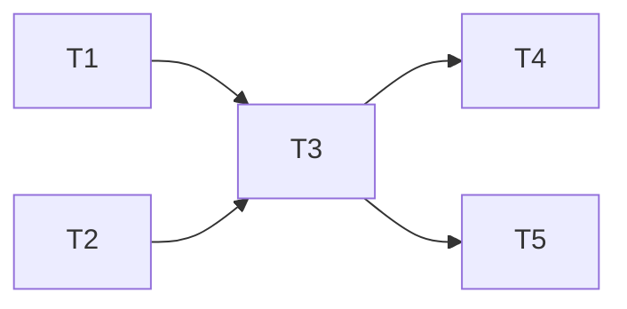

# Provider Health Heartbeat — Implementation Tasks

### Dependency Graph



Tasks 1 and 2 can run in parallel. Task 3 depends on both. Tasks 4 and 5 can run in parallel after Task 3.

---

## Task 1: Server — Add event types to `events.ts`

### What to build

Add the `heartbeat.ping` and `heartbeat.cycle_skipped` variants to the `LiveEvent` union type.

### Exact changes

In `server/src/services/events.ts`, find the `LiveEvent` union type (~L12-20) and add two more variants:

```typescript
| { type: 'heartbeat.ping'; provider: string; model: string; success: boolean; latencyMs: number; error?: string; at: number }
| { type: 'heartbeat.cycle_skipped'; reason: string; lastActivityAgeMs: number; at: number }
```

### What NOT to change

- `publish()` function — no changes needed
- `subscribeSse()` — no changes needed
- The event bus infrastructure — no changes needed

---

## Task 2: Client — Add dashboard rendering to `live-events.tsx`

### What to build

Add the `HeartbeatPingEvent` interface and rendering case for `heartbeat.ping`.

### Exact changes

**2a.** Add interface (after `ModelSwitchEvent` ~L16):

```typescript
interface HeartbeatPingEvent extends LiveEventBase {
  type: 'heartbeat.ping'; provider: string; model: string; success: boolean; latencyMs: number; error?: string;
}
```

**2b.** Add to `LiveEvent` union (~L18):

```typescript
type LiveEvent = RequestStartEvent | RequestDoneEvent | RequestErrorEvent | KeyExhaustedEvent | KeyRetryEvent | ModelSwitchEvent | HeartbeatPingEvent;
```

**2c.** Add `'warn'` to `LogEntry.kind` union (~L24):

```typescript
kind: 'start' | 'done' | 'error' | 'info' | 'warn';
```

**2d.** Add styling for `warn` kind in the className conditional (~L166-169):

```typescript
l.kind === 'warn' ? 'text-amber-600 dark:text-amber-400'
```

Insert before the `l.kind === 'info'` fallback.

**2e.** Add case to `formatEvent` switch (before the closing brace ~L45):

```typescript
case 'heartbeat.ping':
  if (evt.success) {
    return { id: evt.id, ts, kind: 'info',
      text: `♥ [heartbeat] ${evt.provider}/${evt.model} healthy (${evt.latencyMs}ms)` };
  }
  return { id: evt.id, ts, kind: 'warn',
    text: `♥ [heartbeat] ${evt.provider}/${evt.model} FAILED: ${evt.error?.slice(0, 60) ?? 'unknown'}` };
```

### Critical invariants

- `kind: 'warn'` must be added to the LogEntry type union AND the styling conditional — without both, warn-level events render with default muted styling
- Heartbeat events use `♥` prefix for visual distinction from routing events
- Only `heartbeat.ping` is rendered — `heartbeat.cycle_skipped` is intentionally not shown (too noisy for the live feed)

---

## Task 3: Server — Create `heartbeat.ts` module

### What to build

New file `server/src/services/heartbeat.ts` containing all heartbeat logic.

### Module structure

```typescript
/**
 * Provider Health Heartbeat
 *
 * Sends periodic minimal pings to each enabled provider to proactively
 * detect outages. Results feed the degradation engine so the bandit
 * scorer already knows provider health before the first user request.
 *
 * Activity-gated: only pings when a user request was made recently.
 * One ping per provider per cycle to minimize upstream channel consumption.
 *
 * Opt-in: disabled by default (HEARTBEAT_ENABLED=false).
 */
```

### Configuration (module-level, read once)

```typescript
const ENABLED = process.env.HEARTBEAT_ENABLED === 'true';
const INTERVAL_MS = (parseInt(process.env.HEARTBEAT_INTERVAL_MIN ?? '10', 10)) * 60 * 1000;
const ACTIVITY_WINDOW_MS = (parseInt(process.env.HEARTBEAT_ACTIVITY_WINDOW_MIN ?? '15', 10)) * 60 * 1000;
const PING_TIMEOUT_MS = parseInt(process.env.HEARTBEAT_TIMEOUT_MS ?? '10000', 10);
const STAGGER_MS = parseInt(process.env.HEARTBEAT_STAGGER_MS ?? '2000', 10);
```

### State (module-level)

```typescript
let timerRef: NodeJS.Timeout | null = null;
let lastActivityAt = 0;
let cycleInProgress = false;
```

### Exported functions

**`recordActivity()`**: Called from `proxy.ts` on every `/chat/completions` request. Updates `lastActivityAt = Date.now()`. O(1), no I/O.

**`startHeartbeat()`**: Called from server bootstrap. If `ENABLED`, creates `setInterval(runCycle, INTERVAL_MS)`. Stores reference in `timerRef`. Logs startup.

**`stopHeartbeat()`**: Called from graceful shutdown. `clearInterval(timerRef)`. Sets `timerRef = null`.

### Internal functions

**`runCycle()`**: The main cycle logic:
1. Guard: if `cycleInProgress`, return (prevent concurrent cycles).
2. Set `cycleInProgress = true`.
3. Check activity gate. If gated, emit `cycle_skipped`, set `cycleInProgress = false`, return.
4. Query enabled platforms from fallback chain (single SQL).
5. Group by platform, pick healthiest model per platform (lowest `getPenalty()`).
6. For each platform (staggered by `STAGGER_MS`): call `pingProvider()`.
7. Set `cycleInProgress = false` in `finally` block.

**`pingProvider(platform, modelDbId, modelId)`**:
1. Query enabled keys for the platform.
2. Filter out keys on cooldown (`isOnCooldown`) or exhausted (`isExhausted`).
3. Pick first eligible key. If none, return silently.
4. Decrypt key via `decrypt()`.
5. Call `provider.chatCompletion()` with `{ messages: [{role:'user', content:'hi'}], max_tokens: 5, temperature: 0 }`.
6. Wrap in `withTimeout(promise, PING_TIMEOUT_MS)`.
7. On success: `recordSuccess(modelDbId)`, emit `heartbeat.ping` (success=true).
8. On failure: `classifyError(err)`. If `'major'` or `'minor'`, call `recordFailure`. If `null` (non-retryable), log warning only. Emit `heartbeat.ping` (success=false).

**`withTimeout<T>(promise, ms)`**: Race a promise against a setTimeout. Timeout error message includes the ms value so `classifyError` classifies it as `'major'` (matches `'timeout'`).

### Imports needed

```typescript
import { getDb } from '../db/index.js';
import { decrypt } from '../lib/crypto.js';
import { buildProviderFor } from '../providers/index.js';
import { isOnCooldown } from './ratelimit.js';
import { isExhausted } from './key-exhaustion.js';
import { classifyError, recordFailure, recordSuccess, getPenalty } from './degradation.js';
import { publish } from './events.js';
```

### Critical invariants

- `cycleInProgress` flag prevents concurrent cycles when a cycle outlasts the interval
- Pings NEVER call `recordRequest()`, `recordTokens()`, `setCooldown()`, or insert into `requests` table
- `lastActivityAt = 0` at startup means the first cycle is always gated (no pings until at least one real request)
- The `decrypt()` call is inside a try/catch — decryption failure skips the provider, doesn't crash the cycle
- `buildProviderFor()` can return undefined for deleted custom providers — guard against this
- All async errors in `pingProvider` are caught — one failing provider doesn't abort the cycle for others

---

## Task 4: Server — Integrate heartbeat into proxy and server bootstrap

### What to build

Wire the heartbeat into the existing codebase at two points.

### Exact changes

**4a.** Add activity recording to `proxy.ts`:

At the top of the `/chat/completions` handler (after authentication succeeds, ~L492), add:

```typescript
import { recordActivity } from '../services/heartbeat.js';
// ... inside handler, after auth check passes:
recordActivity();
```

This is one import + one function call. O(1), no I/O, no side effects when heartbeat is disabled.

**4b.** Add startup/shutdown hooks to server bootstrap (`server/src/index.ts` or equivalent):

```typescript
import { startHeartbeat, stopHeartbeat } from './services/heartbeat.js';

// After server.listen() callback:
startHeartbeat();

// In SIGTERM/SIGINT handler (if one exists):
stopHeartbeat();
```

If the server doesn't have a graceful shutdown handler, add `stopHeartbeat` to a `process.on('SIGTERM', ...)` handler.

### Critical invariants

- `recordActivity()` is called AFTER authentication — unauthenticated requests don't count toward the activity gate
- `startHeartbeat()` is a no-op when `HEARTBEAT_ENABLED !== 'true'` — safe to always call
- `stopHeartbeat()` is safe to call even if `startHeartbeat()` was never called (guards against `timerRef === null`)

---

## Task 5: Tests — Add unit tests for heartbeat

### What to build

New test file `server/src/__tests__/services/heartbeat.test.ts`.

### Test structure

```typescript
import { describe, it, expect, beforeEach, afterEach, vi } from 'vitest';
import { recordActivity, startHeartbeat, stopHeartbeat } from '../../services/heartbeat.js';
import * as degradation from '../../services/degradation.js';
import * as ratelimit from '../../services/ratelimit.js';
import * as keyExhaustion from '../../services/key-exhaustion.js';
import { getDb, initDb } from '../../db/index.js';

// Mock providers to control ping success/failure
vi.mock('../../providers/index.js', () => ({
  buildProviderFor: vi.fn(),
}));

vi.mock('../../lib/crypto.js', () => ({
  decrypt: vi.fn(() => 'mocked-api-key'),
}));
```

### Test cases (minimum set)

#### Group: Activity gate

| Test | Setup | Assertion |
|---|---|---|
| No activity → cycle skipped | `lastActivityAt = 0`, timer fires | `cycle_skipped` event emitted, no pings |
| Recent activity → cycle runs | `recordActivity()` called, timer fires | Pings fire for enabled platforms |
| Stale activity → cycle skipped | `recordActivity()` called, advance time beyond window | `cycle_skipped` emitted |

#### Group: Ping behavior

| Test | Setup | Assertion |
|---|---|---|
| Successful ping calls recordSuccess | Mock provider returns 200 | `recordSuccess` called with correct modelDbId |
| 503 ping calls recordFailure(major) | Mock throws 503 | `recordFailure` called with modelDbId, `'major'` |
| 429 ping calls recordFailure(minor) | Mock throws 429 | `recordFailure` called with modelDbId, `'minor'` |
| Timeout ping calls recordFailure(major) | Mock hangs > PING_TIMEOUT_MS | `recordFailure` called with `'major'` |
| 401 ping NOT penalized | Mock throws 401 | `recordFailure` NOT called |

#### Group: Provider selection

| Test | Setup | Assertion |
|---|---|---|
| One ping per provider | 2 models on same platform | Only 1 ping sent for that platform |
| Healthiest model selected | model A penalty=10, model B penalty=0 | Ping uses model B |
| No eligible key skips provider | All keys on cooldown | Provider skipped, no error |

#### Group: Configuration

| Test | Setup | Assertion |
|---|---|---|
| Disabled → no timer | `HEARTBEAT_ENABLED=false` | `startHeartbeat()` creates no interval |
| Enabled → timer created | `HEARTBEAT_ENABLED=true` | `startHeartbeat()` creates interval |
| stopHeartbeat clears timer | After `startHeartbeat()` | `stopHeartbeat()` clears interval |

#### Group: Event emission

| Test | Assertion |
|---|---|
| Success event shape | `heartbeat.ping` with `success: true`, `provider`, `model`, `latencyMs` |
| Failure event shape | `heartbeat.ping` with `success: false`, `error` field populated |
| Cycle skip event | `heartbeat.cycle_skipped` with `reason: 'activity_gate'` |

### Critical invariants

- Tests use `vi.useFakeTimers()` to control `setInterval` — no real waiting
- Mock `buildProviderFor` returns a mock provider object with controllable `chatCompletion`
- Mock `decrypt` returns a fixed string
- Tests seed the SQLite database with fallback chain rows and api_keys rows
- `afterEach` must call `stopHeartbeat()` and `vi.useRealTimers()` for cleanup
- Environment variables set in `beforeEach`, restored in `afterEach`

---

## Task 6: Run existing test suite to verify no regressions

### What to do

After Tasks 1-5 are complete, run:

```bash
npm run test -w server
```

Verify:
- All existing tests pass (especially `routing-exhaustion.test.ts`, `router-bandit.test.ts`)
- New heartbeat test file passes
- Client typecheck passes (`npm run test -w client` or equivalent)

### Expected failures

None — the heartbeat is opt-in and disabled by default. When disabled, `startHeartbeat()` is a no-op and `recordActivity()` is a one-line timestamp update with no side effects. If any test breaks, it indicates an integration issue in the implementation.
